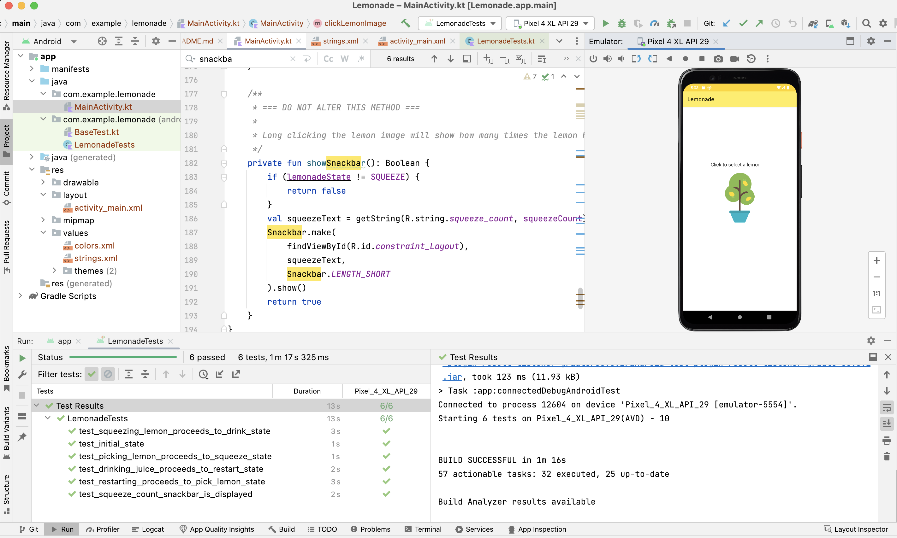

# Project: Lemonade App - Starter Code

This project is based on the starter code for the first independent project for [Android Basics in Kotlin](https://developer.android.com/courses/android-basics-kotlin/course)

# Demo

[recording.webm](https://user-images.githubusercontent.com/4522927/219721325-e8cdcdbb-01ec-40b1-ab8d-4040af8063ef.webm)

# Tests pass!

